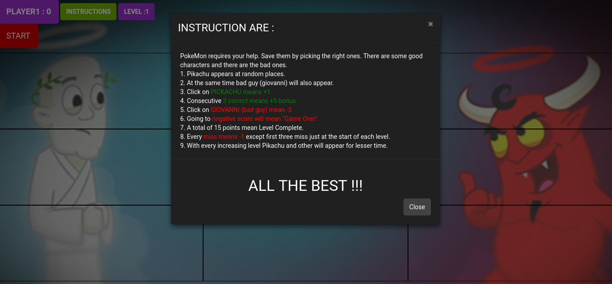

# PIKACHU-GAME-angular-js-
-It is a pokemon game, developed from angular js using bootstrap and other dependencies. 
- Have a demo [here](https://pikachu-game-angular-js.firebaseapp.com/)
### SCREENSHOTS :-

    

    

    

